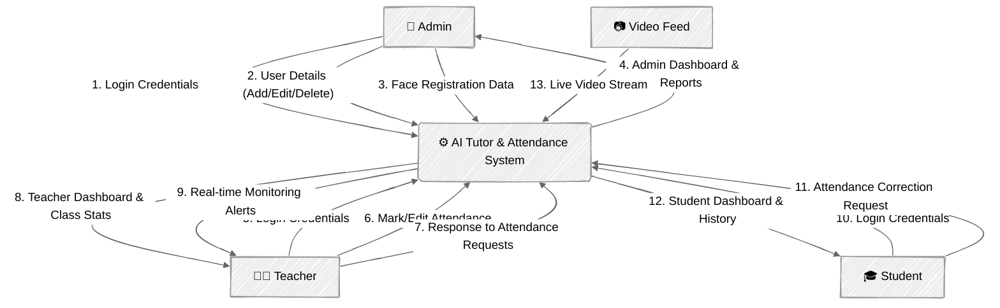
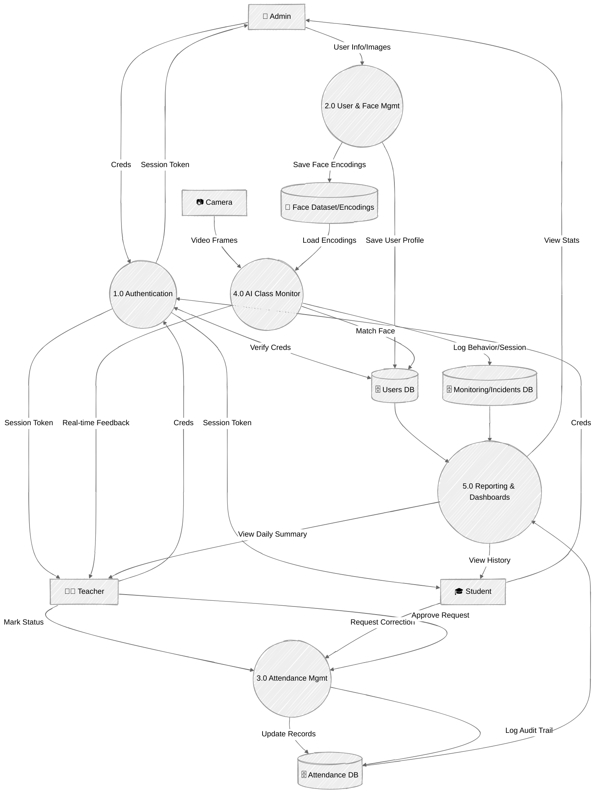

# AI Tutor & Attendance System

## System Overview
The **AI Tutor & Attendance System** is a comprehensive solution for managing academic attendance, behavior monitoring, and user administration. It leverages **Face Recognition** (LBPH/Face_Recognition) for automated verification and real-time class monitoring.

---

## Data Flow Diagrams (DFD)

### DFD Level 0: Context Diagram
This diagram represents the entire system as a single process interacting with external entities (Actors).

### DFD Level 1: Process Decomposition
This diagram breaks down the main system into its core sub-processes and data stores.

